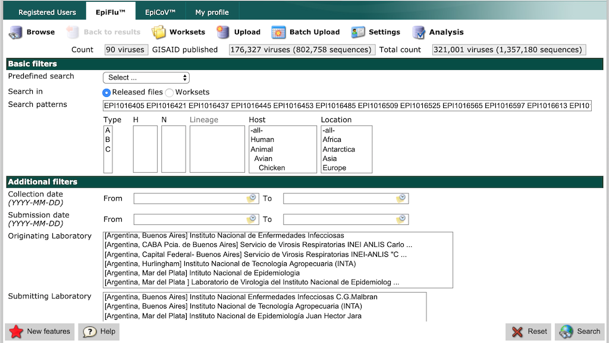
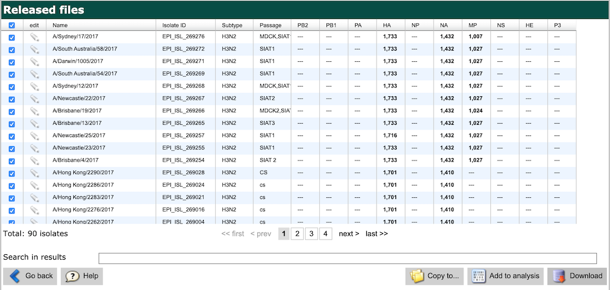
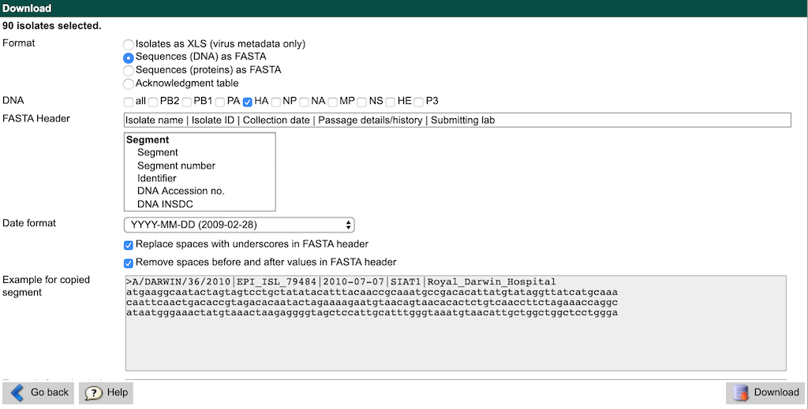

# Integrative prediction of seasonal influenza evolution by genotype and phenotype

## Installation

[Install miniconda](https://conda.io/miniconda.html).
Clone the forecasting repository.

```bash
git clone https://github.com/blab/flu-forecasting.git
cd flu-forecasting
```

Create and activate a conda environment for the pipeline.

```bash
conda env create -f envs/anaconda.python3.yaml
conda activate flu_forecasting
```

## Quickstart (sparse simulated populations only)

Run the pipeline for sparse simulated data.
This will first simulate influenza-like populations and then fit models to those populations.
Inspect all steps to be executed by the pipeline with a dryrun.

```bash
snakemake --dryrun --use-conda --config active_builds='simulated_sample_1'
```

Run the pipeline locally with four jobs (or cores) at once.

```bash
snakemake --use-conda --config active_builds='simulated_sample_1' -j 4
```

Always specify a value for `-j`, to limit the number of cores available to the simulator.
If no limit is provided, the Java-based simulator will attempt to use all available cores and may cause headaches for you or your cluster's system administrator.

## Run the complete analysis with simulated and natural populations

### Download sequences for natural populations

All hemagglutinin sequences for natural populations are available through [the GISAID database](https://www.gisaid.org/).
To get access to the database, register for a free GISAID account.
After logging into GISAID, select the "EpiFlu" tab from the navigation bar.

Downloading sequences from GISAID requires manually searching for specific accessions (i.e., sequence identifiers) and downloading the corresponding sequences.
The maximum length of the GISAID search field is 1,000 characters, so you cannot search for all 20,000+ sequences at once.
To facilitate the download process, we have created batches of accessions no longer than 1,000 characters in the file [data/gisaid_batches.csv](data/gisaid_batches.csv).
Each of the 216 batches has its own id and expected number of sequences, to help you track your progress.
Copy and paste the list of accessions from each batch into the "Search patterns" field of the GISAID search and select the "Search" button.
An example search is shown below.



From the search results display, select the checkbox in the top-left of the search display (above the checkbox for the first row of results).
This will select all matching sequences to be downloaded.
Click the "Download" button.
An example of these search results is shown below.



When the download dialog appears, select the "Sequences (DNA) as FASTA" radio button.
Click the checkbox near "HA" to only download hemagglutinin sequences.
Delete the contents of the "FASTA Header" text field and paste in the following line instead:

```
Isolate name | Isolate ID | Collection date | Passage details/history | Submitting lab
```

Leave all other fields at their default values.
The download interface should look like the following screenshot.



Click the "Download" button and name the resulting FASTA file with the same id as your current batch (e.g., `gisaid_downloads/gisaid_epiflu_sequence_1.fasta`).
This file naming convention will make tracking your progress easier.
When you have downloaded sequences for all batches, concatenate them together into a single file.

```bash
cat gisaid_downloads/gisaid_epiflu_sequence_*.fasta > gisaid_downloads.fasta
```

Use augur to parse out the metadata and sequences into separate files.
Store these files in a directory with the same name as the natural samples in this analysis.

```bash
# Write out sequences and metadata for the validation sample.
mkdir -p data/natural/natural_sample_1_with_90_vpm
augur parse \
    --sequences gisaid_downloads.fasta \
    --output-sequences data/natural/natural_sample_1_with_90_vpm/sequences.fasta \
    --output-metadata data/natural/natural_sample_1_with_90_vpm/metadata.tsv \
    --fields strain accession collection_date passage_category submitting_lab

# Copy the resulting sequences and metadata into the test sample directory.
mkdir -p data/natural/natural_sample_1_with_90_vpm_test_tree
cp data/natural/natural_sample_1_with_90_vpm/* data/natural/natural_sample_1_with_90_vpm_test_tree/
```

Now, you should be able to run the pipeline from start to finish.
Confirm this is true by running snakemake in dry run mode.

```bash
snakemake --dryrun
```

### Run the complete analysis

Run the entire pipeline locally with four simultaneous jobs.

```bash
snakemake --use-conda -j 4
```

You can also run just one of the natural builds as follows, to confirm your environment is configured properly.

```bash
snakemake --use-conda --config active_builds='natural_sample_1_with_90_vpm_sliding' -j 4
```

Alternately, follow [Snakemake documentation to distribute the entire pipeline to your cloud or cluster accounts](https://snakemake.readthedocs.io/en/stable/executing/cluster-cloud.html).
The following is an example of how to distribute the pipeline on a SLURM-based cluster using a Snakemake profile.

```bash
snakemake --profile profiles/slurm-drmaa
```

## Configuration

Analyses are parameterized by the contents of `config.json`.
Models are fit to annotated data frames created for one or more "builds" from one or more "datasets".
Datasets and builds are decoupled to allow multiple builds from a single dataset.
Builds are split into "simulated" and "natural" such that each entry in one of these categories is a dictionary of build settings indexed by a build name.
The list of active builds is determined by the space-delimited values in the `active_builds` top-level key of the configuration.

## Inputs

The only inputs currently are the configuration file, `config.json`, and the data downloaded from fauna.

## Outputs

| Filename | Contents |
|:---:|:---:|
| results/distance_model_errors.tsv | table of model errors per build, timepoint, and model |
| results/distance_model_coefficients.tsv | table of model coefficients per build, timepoint, and model |
