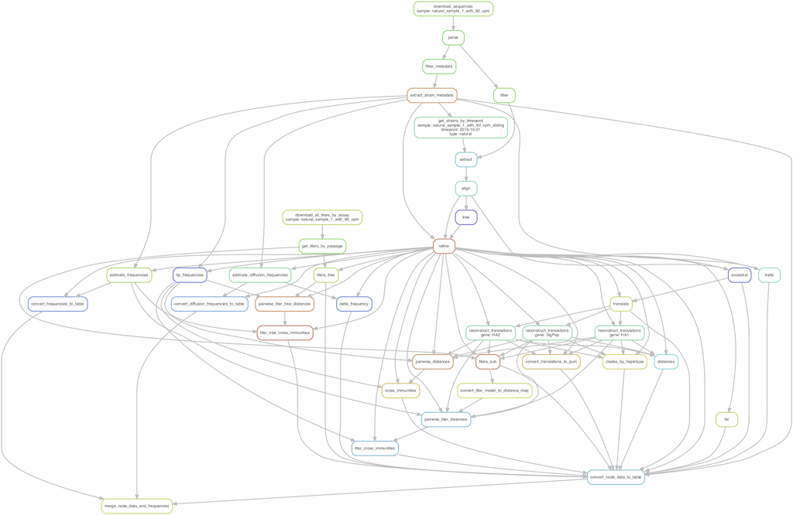

# Integrating genotypes and phenotypes improves long-term forecasts of seasonal influenza A/H3N2 evolution

**John Huddleston<sup>1,2</sup>, John R. Barnes<sup>3</sup>, Thomas Rowe<sup>3</sup>, Xiyan Xu<sup>3</sup>, Rebecca Kondor<sup>3</sup>, David E. Wentworth<sup>3</sup>, Lynne Whittaker<sup>4</sup>, Burcu Ermetal<sup>4</sup>, Rodney S. Daniels<sup>4</sup>, John W. McCauley<sup>4</sup>, Seiichiro Fujisaki<sup>5</sup>, Kazuya Nakamura<sup>5</sup>, Noriko Kishida<sup>5</sup>, Shinji Watanabe<sup>5</sup>, Hideki Hasegawa<sup>5</sup>, Ian Barr<sup>6</sup>, Kanta Subbarao<sup>6</sup>, Pierre Barrat-Charlaix<sup>7,8</sup>, Richard A. Neher<sup>7,8</sup> & Trevor Bedford<sup>1</sup>**

<sup>1</sup>Vaccine and Infectious Disease Division, Fred Hutchinson Cancer Research Center, Seattle, WA, USA, <sup>2</sup>Molecular and Cell Biology, University of Washington, Seattle, WA, USA, <sup>3</sup>Virology Surveillance and Diagnosis Branch, Influenza Division, National Center for Immunization and Respiratory Diseases (NCIRD), Centers for Disease Control and Prevention (CDC), 1600 Clifton Road, Atlanta, GA 30333, USA, <sup>4</sup>WHO Collaborating Centre for Reference and Research on Influenza, Crick Worldwide Influenza Centre, The Francis Crick Institute, London, UK., <sup>5</sup>Influenza Virus Research Center, National Institute of Infectious Diseases, Tokyo, Japan, <sup>6</sup>The WHO Collaborating Centre for Reference and Research on Influenza, The Peter Doherty Institute for Infection and Immunity, Melbourne, VIC, Australia; Department of Microbiology and Immunology, The University of Melbourne, The Peter Doherty Institute for Infection and Immunity, Melbourne, VIC, Australia., <sup>7</sup>Biozentrum, University of Basel, Basel, Switzerland, <sup>8</sup>Swiss Institute of Bioinformatics, Basel, Switzerland

## Contents

  1. [Abstract](#abstract)
  1. [Installation](#installation)
  1. [Quickstart](#quickstart)
  1. [Configuration](#configuration)
  1. [Workflow structure](#workflow-structure)
  1. [Full analysis](#full-analysis)

## Abstract

Seasonal influenza virus A/H3N2 is a major cause of death globally.
Vaccination remains the most effective preventative.
Rapid mutation of hemagglutinin allows viruses to escape adaptive immunity.
This antigenic drift necessitates regular vaccine updates.
Effective vaccine strains need to represent H3N2 populations circulating one year after strain selection.
Experts select strains based on experimental measurements of antigenic drift and predictions made by models from hemagglutinin sequences.
We developed a novel influenza forecasting framework that integrates phenotypic measures of antigenic drift and functional constraint with previously published sequence-only fitness estimates.
Forecasts informed by phenotypic measures of antigenic drift consistently outperformed previous sequence-only estimates, while sequence-only estimates of functional constraint surpassed more comprehensive experimentally-informed estimates.
Importantly, the best models integrated estimates of both functional constraint and either antigenic drift phenotypes or recent population growth.

## Installation

[Install miniconda](https://conda.io/miniconda.html).
Clone the forecasting repository.

```bash
git clone https://github.com/blab/flu-forecasting.git
cd flu-forecasting
```

Create and activate a conda environment for the pipeline.

```bash
conda env create -f envs/anaconda.python3.yaml
conda activate flu_forecasting
```

## Quickstart

Run the pipeline for sparse simulated data.
This will first simulate influenza-like populations and then fit models to those populations.
Inspect all steps to be executed by the pipeline with a dryrun.

```bash
snakemake --dryrun --use-conda --config active_builds='simulated_sample_1'
```

Run the pipeline locally with four jobs (or cores) at once.

```bash
snakemake --use-conda --config active_builds='simulated_sample_1' -j 4
```

Always specify a value for `-j`, to limit the number of cores available to the simulator.
If no limit is provided, the Java-based simulator will attempt to use all available cores and may cause headaches for you or your cluster's system administrator.

## Configuration

Analyses are parameterized by the contents of `config/config.json`.
Models are fit to annotated data frames created for one or more "builds" from one or more "datasets".
Datasets and builds are decoupled to allow multiple builds from a single dataset.
Builds are split into "simulated" and "natural" such that each entry in one of these categories is a dictionary of build settings indexed by a build name.
The list of active builds is determined by the space-delimited values in the `active_builds` top-level key of the configuration.

## Workflow structure

### Workflow

The analyses for this paper were produced using a workflow written with [Snakemake](http://snakemake.readthedocs.io/).
[The complete graph of the workflow is available as a PDF](docs/figures/full_dag.pdf).
This PDF was created with the following Snakemake command.

```bash
snakemake --forceall --dag manuscript/flu_forecasting.pdf | dot -Tpdf > full_dag.pdf
```

Below is a subset of the complete workflow showing how tip attributes are created for a single timepoint (2015-10-01) from the natural populations analysis.
This image was created with the following Snakemake command.

```bash
snakemake --forceall --dag \
  results/builds/natural/natural_sample_1_with_90_vpm_sliding/timepoints/2015-10-01/tip_attributes.tsv | \
  dot -Tpng > example_dag.png
```



### Inputs

Both simulated and natural population builds depend on [the configuration file](#configuration), `config/config.json`, described above.

Simulated populations are generated by SANTA-SIM as part of the workflow.
SANTA-SIM XML configuration files determine the parameters of the simulations and can be found in the corresponding data directory for a given simulated sample.
For example, the densely sampled simulated populations configuration file is `data/simulated/simulated_sample_3/influenza_h3n2_ha.xml`.

Natural populations are represented by FASTA sequences that are freely available through GISAID.
See [instructions on how to download these sequences below](#download-sequences-for-natural-populations).
The full analysis for this paper also depends on raw hemagglutination inhibition (HI) and focus-reduction assay (FRA) titer measurements.
Although these measurements are not publicly available, due to existing data sharing agreements, we provide imputed log2 titer values produced by Neher al. 2016's phylogenetic model for each strain.
These values are available in the results files named `tip_attributes_with_weighted_distances.tsv`.
For example, the complete set of tip attributes including imputed titer drops for the validation period of natural populations are available in `results/builds/natural/natural_sample_1_with_90_vpm_sliding/tip_attributes_with_weighted_distances.tsv`.

### Outputs

The primary outputs of this workflow are tables of tip attributes per populations that are used to fit models (`tip_attributes_with_weighted_distances.tsv`) and the tables of resulting model coefficients (`distance_model_coefficients.tsv`) and distances to the future (`distance_model_errors.tsv`).
Data for validation figures (e.g., Figures 4 and 7) can be found in `validation_figure_clades.tsv` and `validation_figure_ranks.tsv`.
Additional outputs include the mapping of individual strains to clades (`tips_to_clades.tsv`) for the creation of model validation figures (e.g., comparison of estimated and observed clade frequency fold changes and absolute forecasting errors).
The following outputs are included in this repository and are also created by running the full analysis pipeline.

  - `results/`
    - `distance_model_errors.tsv`
    - `distance_model_coefficients.tsv`
    - `validation_figure_clades.tsv`
    - `validation_figure_ranks.tsv`
    - `builds/`
      - `natural/`
        - `natural_sample_1_with_90_vpm_sliding/`
          - `tip_attributes_with_weighted_distances.tsv`
        - `natural_sample_1_with_90_vpm_sliding_test_tree/`
          - `tip_attributes_with_weighted_distances.tsv`
      - `simulated/`
        - `simulated_sample_3/`
          - `tip_attributes_with_weighted_distances.tsv`
        - `simulated_sample_3_test_tree/`
          - `tip_attributes_with_weighted_distances.tsv`

The manuscript and most figures and tables within are also automatically generated by the full analysis workflow.
These files can be found in the following paths.

  - `manuscript/`
    - `flu_forecasting.pdf`
    - `figures/`
    - `tables/`

## Full analysis

### Inspect sequences for simulated populations

Each SANTA-SIM run and subsequent subsampling of the resulting sequences will produce a different random collection of sequences for the workflow.
To ensure reproducibility of results, we have included the specific simulated sequences used for analyses in the manuscript.
These sequences and their corresponding metadata are available at the following paths:

  - `data/simulated/simulated_sample_3/filtered_sequences.fasta`
  - `data/simulated/simulated_sample_3/filtered_metadata.tsv`

### Download sequences for natural populations

All hemagglutinin sequences for natural populations are available through [the GISAID database](https://www.gisaid.org/).
To get access to the database, register for a free GISAID account.
After logging into GISAID, select the "EpiFlu" tab from the navigation bar.

Downloading sequences from GISAID requires manually searching for specific accessions (i.e., sequence identifiers) and downloading the corresponding sequences.
The maximum length of the GISAID search field is 1,000 characters, so you cannot search for all 20,000+ sequences at once.
To facilitate the download process, we have created batches of accessions no longer than 1,000 characters in the file [data/gisaid_batches.csv](data/gisaid_batches.csv).
Each of the 216 batches has its own id and expected number of sequences, to help you track your progress.
Copy and paste the list of accessions from each batch into the "Search patterns" field of the GISAID search and select the "Search" button.
An example search is shown below.


From the search results display, select the checkbox in the top-left of the search display (above the checkbox for the first row of results).
This will select all matching sequences to be downloaded.
Click the "Download" button.
An example of these search results is shown below.


When the download dialog appears, select the "Sequences (DNA) as FASTA" radio button.
Click the checkbox near "HA" to only download hemagglutinin sequences.
Delete the contents of the "FASTA Header" text field and paste in the following line instead:

```
Isolate name | Isolate ID | Collection date | Passage details/history | Submitting lab
```

Leave all other fields at their default values.
The download interface should look like the following screenshot.


Click the "Download" button and name the resulting FASTA file with the same id as your current batch (e.g., `gisaid_downloads/gisaid_epiflu_sequence_001.fasta`).
This file naming convention will make tracking your progress easier.
After the download completes, click the "Go back" button on the download dialog and then again from the search results display.
Copy and paste the next batch of ids into the search field and repeat these steps until you have downloaded all batches.

When you have downloaded sequences for all batches, concatenate them together into a single file.

```bash
cat gisaid_epiflu_sequences/gisaid_epiflu_sequence_*.fasta > gisaid_downloads.fasta
```

Use augur to parse out the metadata and sequences into separate files.
Store these files in a directory with the same name as the natural samples in this analysis.

```bash
# Write out sequences and metadata for the validation sample.
mkdir -p data/natural/natural_sample_1_with_90_vpm
augur parse \
    --sequences gisaid_downloads.fasta \
    --output-sequences data/natural/natural_sample_1_with_90_vpm/filtered_sequences.fasta \
    --output-metadata data/natural/natural_sample_1_with_90_vpm/strains_metadata.tsv \
    --fields strain accession collection_date passage_category submitting_lab

# Copy the resulting sequences and metadata into the test sample directory.
mkdir -p data/natural/natural_sample_1_with_90_vpm_test_tree
cp data/natural/natural_sample_1_with_90_vpm/*.{fasta,tsv} data/natural/natural_sample_1_with_90_vpm_test_tree/
```

Now, you should be able to run the pipeline from start to finish.
Confirm this is true by running snakemake in dry run mode.

```bash
snakemake --dryrun
```

### Inspect derived titer data for natural populations

Due to existing data sharing agreements, we cannot publicly distribute raw titer measurements for hemagglutination inhibition (HI) assays and focus reduction assays (FRAs).
As an alternative, we provide the derived titer models produced by the `augur titers` command using the algorithms described in [Neher et al. 2016](https://www.pnas.org/content/113/12/E1701).
For HI assays, we provide two different model files per analysis timepoint for the titer "tree model" and "substitution model".
These files are named `titers-tree-model.json` and `titers-sub-model.json`, respectively.
For FRAs, we provide model files for the tree model with names like `fra-titers-tree-model.json`.
Example paths for each of these files are listed below for a single timepoint in the analysis of most recent A/H3N2 sequences.

  - `results/builds/natural/natural_sample_20191001/timepoints/2015-10-01/titers-tree-model.json`
  - `results/builds/natural/natural_sample_20191001/timepoints/2015-10-01/titers-sub-model.json`
  - `results/builds/natural/natural_sample_20191001/timepoints/2015-10-01/fra-titers-tree-model.json`

These model files contain all information required to fit the HI- and FRA-based forecasting models described in the manuscript.

### Run the full analysis

Run the entire pipeline locally with four simultaneous jobs.

```bash
snakemake --use-conda -j 4
```

You can also run just one of the natural builds as follows, to confirm your environment is configured properly.

```bash
snakemake --use-conda --config active_builds='natural_sample_1_with_90_vpm_sliding' -j 4
```

Alternately, follow [Snakemake documentation to distribute the entire pipeline to your cloud or cluster accounts](https://snakemake.readthedocs.io/en/stable/executing/cluster-cloud.html).
The following is an example of how to distribute the pipeline on a SLURM-based cluster using a Snakemake profile.

```bash
snakemake --profile profiles/slurm-drmaa
```
