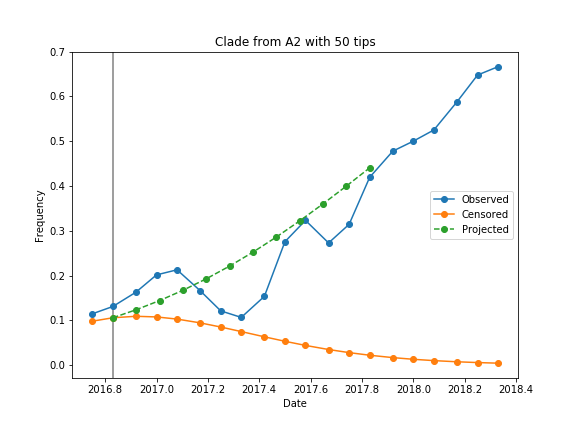

# Projected frequencies analysis

## Example usage

```bash
python scripts/project_frequencies.py \
    dist/augur/builds/flu/auspice/flu_h3n2_ha_2016-2018y_1v_0_tree.json \
    frequencies/flu_h3n2_ha_2016-2018y_1v_0.json \
    model_parameters/2016-2018/1/lbi/0.tab \
    projected_frequencies/flu_h3n2_ha_2016-2018y_1v_0.json \
    2016.1 \
    1.0
```


