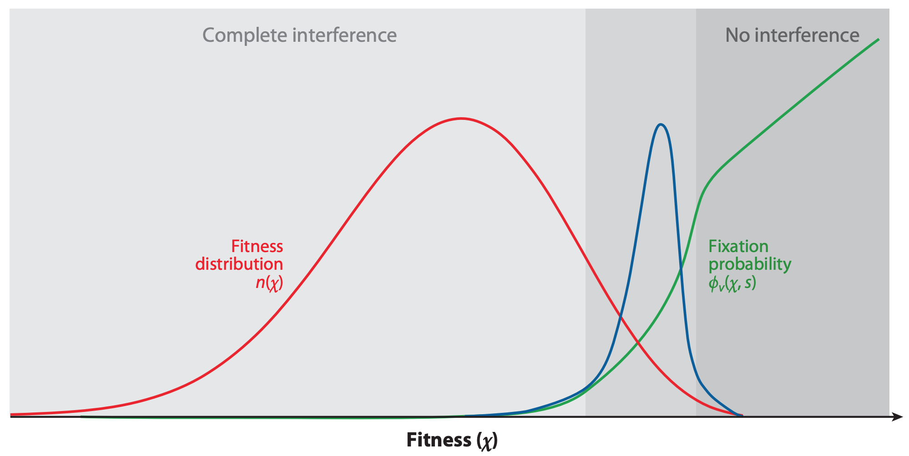

This post summarizes and synthesizes the results of two recent efforts to predict influenza evolution, @huddleston_2020 and @barrat-charlaix_2020.

## Why do we try to predict seasonal influenza evolution?

Seasonal influenza (or "flu") sickens or kills millions of people per year.
Flu vaccines are one of the most effective preventative measures against infection.
However, flu vaccines require almost a year to develop and can only contain a single representative virus per flu lineage (e.g., A/H3N2, A/H1N1pdm, etc.).
These limitations require researchers to predict which single current flu virus will be the most representative of the flu population one year in the future.
The better these predictions are, the more likely the vaccine will prevent illness and death from infection.

## How do we think flu evolves?

Flu rapidly accumulates mutations during replication, due to its error-prone RNA-dependent RNA polymerase.
For most flu genes, amino acid mutations will weaken the functionality of their corresponding proteins and reduce the virus's fitness.
For flu's primary surface proteins, hemagglutinin (HA) and neuraminidase (NA), some amino acid mutations modify binding sites of host antibodies from previous infections.
These mutations increase a virus's fitness by allowing the virus to escape existing antibodies in a process called antigenic drift (\autoref{fig:beneficial-and-deleterious-mutations}).
HA and NA experience fitness trade-offs, as they acquire beneficial mutations associated with antigenic drift against a background of deleterious mutations.

![HA accumulates beneficial mutations in its head domain that enable escape from antibody binding and deleterious mutations in its stalk domain that reduce its ability to infect new host cells. [Explore this figure interactively with dms-view.](https://dms-view.github.io/?markdown-url=https%3A%2F%2Fdms-view.github.io%2Fdata%2FIAV%2Flee2019mapping.md&data-url=https%3A%2F%2Fdms-view.github.io%2Fdata%2FIAV%2Fflu_dms-view.csv&condition=2009-age-53&site_metric=site_Positive+Differential+Selection&mutation_metric=mut_Positive+Differential+Selection&selected_sites=52%2C53%2C54%2C55%2C56%2C57%2C58%2C59%2C60%2C61%2C62%2C63%2C64%2C65%2C66%2C67%2C68%2C69%2C70%2C71%2C72%2C73%2C74%2C75%2C76%2C77%2C78%2C79%2C80%2C81%2C82%2C83%2C84%2C85%2C86%2C87%2C88%2C89%2C90%2C91%2C92%2C93%2C94%2C95%2C96%2C97%2C98%2C99%2C100%2C101%2C102%2C103%2C104%2C105%2C106%2C107%2C108%2C109%2C110%2C111%2C112%2C113%2C114%2C115%2C116%2C117%2C118%2C119%2C120%2C121%2C122%2C123%2C124%2C125%2C126%2C127%2C128%2C129%2C130%2C131%2C132%2C133%2C134%2C135%2C136%2C137%2C138%2C139%2C140%2C141%2C142%2C143%2C144%2C145%2C146%2C147%2C148%2C149%2C150%2C151%2C152%2C153%2C154%2C155%2C156%2C157%2C158%2C159%2C160%2C161%2C162%2C163%2C164%2C165%2C166%2C167%2C168%2C169%2C170%2C171%2C172%2C173%2C174%2C175%2C176%2C177%2C178%2C179%2C180%2C181%2C182%2C183%2C184%2C185%2C186%2C187%2C188%2C189%2C190%2C191%2C192%2C193%2C194%2C195%2C196%2C197%2C198%2C199%2C200%2C201%2C202%2C203%2C204%2C205%2C206%2C207%2C208%2C209%2C210%2C211%2C212%2C213%2C214%2C215%2C216%2C217%2C218%2C219%2C220%2C221%2C222%2C223%2C224%2C225%2C226%2C227%2C228%2C229%2C230%2C231%2C232%2C233%2C234%2C235%2C236%2C237%2C238%2C239%2C240%2C241%2C242%2C243%2C244%2C245%2C246%2C247%2C248%2C249%2C250%2C251%2C252%2C253%2C254%2C255%2C256%2C257%2C258%2C259%2C260%2C261%2C262%2C263%2C264%2C265%2C266%2C267%2C268%2C269%2C270%2C271%2C272%2C273%2C274%2C275%2C276&protein-data-color=&protein-other-color=&pdb-url=https%3A%2F%2Fdms-view.github.io%2Fdata%2FIAV%2F4O5N_trimer.pdb) \label{fig:beneficial-and-deleterious-mutations}](images/beneficial-and-deleterious-mutations-in-ha.png "Beneficial and deleterious mutations in HA")

Viruses carrying beneficial mutations should grow exponentially relative to viruses lacking those mutations (\autoref{fig:exponential-growth-with-clonal-interference}A).
If beneficial mutations have large effects on fitness, viruses with different beneficial mutations will compete with each other for hosts in a process known as clonal interference (\autoref{fig:exponential-growth-with-clonal-interference}B).
In this case, the fitness of the genetic background where the beneficial mutations occur is less important for the success of the virus than the fitness effect of the beneficial mutations themselves (\autoref{fig:fitness-landscapes}).
If beneficial mutations have similar smaller effects on fitness, a virus's overall fitness depends on the effect of the beneficial mutations and the relative fitness of its genetic background.
The ultimate success and fixation of these beneficial mutations depends, in part, on the number of deleterious mutations that already exist in the same genome (\autoref{fig:fixation-probability}).

## How can we predict flu evolution?

Experimental and theoretical studies of flu suggest that aspects of flu's evolution might be predictable, at least in the short term.
For example, antibody escape assays [@wolf_2006] and retrospective analyses of mutational sweeps [@shih_2005] and positive selection [@bush_2000] reveal that fewer than a quarter of the 566 amino acids in HA contribute to antigenic drift.
Simulations and historical analysis of antigenic drift similarly indicate that flu's phenotypic evolution is restricted at any given point in time [@smith_cartography_2004; @bedford_canalization_2012].
@koel_2013 experimentally confirmed that mutations at seven previously identified epitope sites could explain major antigenic drift events in recent history.
The population genetic theory of flu evolution described above provides expectations about how mutations associated with antigenic drift should determine viral fitness.

Recently, researchers have built on this evidence to create formal predictive models of flu evolution.
@neher_predicting_2014 used expectations from traveling wave models to define the "local branching index" (LBI) estimate of viral fitness.
LBI assumes that most extant viruses descend from a highly fit ancestor in the recent past and uses patterns of rapid branching in phylogenies to identify putative fit ancestors (\autoref{fig:lbi}).
@neher_predicting_2014 showed that LBI could successfully identify ancestral nodes that were highly representative of the flu population one year in the future.
Similarly, @neher_prediction_2016 mapped experimental measurements of antigenic drift to phylogenies to identify the most representative virus in the future flu population.

@luksza_predictive_2014 developed a mechanistic model to forecast flu evolution based on population genetic theory and previous experimental work.
This model assumed that flu viruses grow exponentially as a function of their fitness, compete with each other for hosts through clonal interference, and balance positive effects of mutations at sites previously associated with antigenic drift and deleterious effects of all other mutations.
Instead of predicting the most representative virus of the future population, @luksza_predictive_2014 explicitly predicted the future frequencies of entire clades.

Despite the success of these predictive models, other aspects of flu evolution complicate predictions.
When multiple beneficial mutations with large effects emerge in a population, the clonal interference between viruses reduces the probability of fixation for all mutations involved.
Flu populations also experience multiple bottlenecks in space and time including transmission between hosts, global circulation, and seasonality.
These bottlenecks likely reduce flu's effective population size and reduce the predictability of beneficial mutations sweeping globally.
Finally, antigenic escape assays with polyclonal human sera suggest that successful viruses must accumulate multiple beneficial mutations of large effect to successfully evade the diversity of global host immunity [@lee_mapping_2019].

## Does flu evolve like we think it does?

In [Barrat-Charlaix et al.](https://www.biorxiv.org/content/10.1101/2020.07.31.231100v1), we investigated the predictability of influenza mutation frequencies.
We explicitly avoided modeling flu evolution and focused on an empirical account of long-term outcomes for mutation frequency trajectories.
We selected all available HA and NA sequences for flu lineages A/H3N2 and A/H1N1pdm, performed multiple sequence alignments per lineage and gene, binned sequences by month, and calculated the frequencies of mutations per site and month.
From these data, we constructed frequency trajectories of individual mutations that were rising in frequency from zero.
We expected these rising mutations to represent beneficial, large-effect mutations that would sweep through the global population as predicted by the traveling wave models described above.
By considering individual mutations, we effectively averaged the outcomes of these mutations across all genetic backgrounds.
We evaluated the outcomes of trajectories for mutations that had risen from 0% to approximately 30% global frequency and classified trajectories for mutations that fixed, died out, or persisted as polymorphisms.

<!-- Import Vega & Vega-Lite (does not have to be from CDN) -->

<!-- Import vega-embed -->

As shown above, the average trajectory of individual rising A/H3N2 mutations failed to rise toward fixation.
Instead, the future frequency of these mutations was no higher on average than their initial frequency.
We repeated this analysis for mutations with initial frequencies of 50% and 75% and for mutations in A/H1N1pdm and found nearly the same results.
From these results, we concluded that it is not possible to predict the short-term dynamics of individual mutations based solely on their recent success.

Next, we calculated the fixation probability of each mutation trajectory based on its initial frequency.
Surprisingly, we found that the fixation probabilities of A/H3N2 mutations were equal to their initial frequencies.
This pattern corresponds to what we expect for mutations evolving neutrally.
Generally, the pattern remained the same even when we binned mutations by high LBI, presence at epitope sites, multiple appearances of a mutation in a tree, geographic spread, or other potential metrics associated with high fitness.
We concluded that the recent success of rising mutations provides no information about their eventual fixation.

We tested whether we could explain these results by genetic linkage or clonal interference by simulating flu-like populations under these evolutionary constraints.
Mutation trajectories from simulated populations were more predictable than those from natural populations.
The closest our simulations came to matching the uncertainty of natural populations was when we dramatically increased the rate at which the fitness landscape of simulated populations changed.
These results suggested that we cannot explain the unpredictable nature of flu mutation trajectories by linkage or clonal interference alone.

Since flu mutations appeared to evolve neutrally in the long-term and LBI did not provide information about eventual fixation of mutations, we wondered whether we could identify the most representative sequence of future populations with a different metric.
The consensus sequence is provably the best predictor for a neutrally evolving population.
We found that the consensus sequence is often closer to the future population than the virus sequence with the highest LBI.
Indeed, we found that the top LBI virus was frequently similar to the consensus sequence and often identical.

Taken together, our results from this empirical analysis reveal that beneficial mutations of large effect do not predictably sweep through flu populations and fix.
Instead, the average outcome for any individual mutation evokes neutral evolution, despite the strong positive selection expected to act on these mutations.
Although simulations rule out clonal interference between large effect mutations as an explanation for these results, we cannot discount the role of multiple mutations of similar, smaller effects in the overall fitness of flu viruses.

## Can we forecast flu evolution? (Huddleston et al.)

- We can estimate the composition of a future population's haplotypes with a Malthusian growth model that minimizes the earth mover's distance (EMD) between estimated and observed populations.
- Models based on biologically-informed estimates of viral fitness can make more accurate forecasts of future populations compared to naive forecasts that assume a static population.
- The most accurate forecasts depend on phenotypic measures of antigenic drift (HI assays) and genotypic measures of functional constraint (non-epitope mutations).
  - That this combined model is more accurate than the individual models suggests that forecasts need to account for beneficial effects of antigenic drift and deleterious effects of mutational load
- Models that use epitope mutations to measure antigenic drift fail to predict the future. Previous research where these mutations did predict the future most likely succeeded by inadvertently borrowing information from the future that was encoded in the definition of the epitope mutations themselves.
- Biologically-informed models can also estimate
    - future clade frequencies more accurately than the naive model but with substantial forecasting error for mid-frequency clades (i.e., 15-50% frequency)
    - the single closest strain to the future (the future population's centroid), but they do not perform much better than the naive model on average.
- Models based on recent positive variation of frequency do not perform well either.
- The dynamics of clade frequencies can be somewhat predicted, again compared to the naive scenario. *Note*: How are clades defined? Not clear to me.
- Distance from consensus sequence is nearly as good at predicting distance to future natural populations as antigenic phenotypes and mutational load (include figure here)

## How have these results changed how we think about flu evolution?

 - From Barrat-Charlaix: "previous methods to predict influenza evolution work primarily because they pick strains that represent the future well, not because they predict future dynamics"
 - The genetic background of beneficial mutations is an important part of future success
   - The average behavior of rising mutations does not behave as expected
   - Fitness models based on phenotypes of antigenic drift and mutational load produce the most robust forecasts and outperform naive (neutral) models
   - Fitness models based on epitope mutations and DMS preferences from specific historical contexts fail to forecast the future
 - A neutral (naive or consensus) model selects the closest individual virus to the future population nearly as well or better than other biologically-informed models. Even if fitness models can more accurately estimate the composition of future populations than a neutral model, our dependence on a single virus for the vaccine strain prevents us from benefitting from this model-based improvement.

 - Predictability of specific targets
   - Fixation probability of individual mutations: not predictable
   - Frequency dynamics of mutations or clades one year or more in the future: not predictable for mutations, weakly predictable for clades
   - Haplotype composition of future populations one year in future: weakly predictable with antigenic phenotypes and mutational load
   - Individual closest strain to the future: predictable by naive model or consensus sequence
 - Effectiveness of different fitness metrics (table)
   - initial frequency of rising mutations (or recent change in frequency)
   - epitope mutations
   - non-epitope mutations (i.e., mutational load)
   - local branching index
   - consensus sequence (or naive model or distance from consensus)
   - mutational preferences from deep mutational scanning (DMS) assays
   - antigenic drift from serological assays (hemagglutination inhibition assays)

# Other bits

## Potential figures

 - Examples/cartoons of Malthusian growth, clonal interference, and traveling wave fitness landscapes
 - Sketch/cartoon summarizing different forecasting targets
 - Results from Barrat-Charlaix et al.
     - Frequency trajectories for mutations starting at ~30%
     - Probability of fixation by initial frequency and different metrics
     - Distance to the future by predictor and delta t
 - Forecasting results from Huddleston et al. (one or more of the following)
     - Model performance for best model (EMDs)
     - Clade frequency performance for best model
     - Comparison of best strains for vaccine selection

## Models behind previous forecasting efforts

 - Malthusian growth
 - clonal interference
 - traveling wave representation of fitness distributions
 - examples of previous forecasting efforts
     - Łuksza and Lässig (clade frequencies)
     - Steinbrück and McHardy (mutation frequencies)
     - Neher et al. (phylogenetic growth)
     - Reich et al. 2019, McGowan et al. 2019, etc. (ILI incidence and timing)
 - what we try to predict when we make forecasts
     - the single most representative strain of the future population (e.g., the future population's centroid)
     - the composition of haplotypes and their frequencies in the future population
     - whether an individual mutation or clade will increase or decrease in frequency (a boolean yes/no measure)
     - the frequency of individual mutations
     - the frequency of individual clades (>=15% initial frequency allowing for nested clades)
     - the probability that a mutation or clade will fix in the global population after some delta time

## Key differences

- Huddleston et. al. is based on fitness models, whereas Barrat-Charlaix et. al. considers "raw" data only.
- H predicts (one year ahead)
    - the population, with the EMD as a measure
    - clade frequencies
    - the single closest strain to the future
- H uses phenotypic measures of antigenic drift in addition to sequence-based measures
- BC tries to see if frequency trajectories of mutations show signs of selection that would make them predictable. This is addressed for short-term dynamics (do trajectories have inertia), and long-term destiny of mutations (fixation).
- H considers frequencies of haplotypes, whereas BC considers individual mutations. This is important, as clades are disjoint but mutations are not. A strain belongs to one clade only, but could carry different mutations.

## What we learned

- Fixation of a mutation is something hard to predict (beyond current frequency)
- But with models, one can to some extent predict what the pop. will look like a year ahead.
- Short term dynamics of the frequency of a mutation is also hard to predict. Frequency trajectories of mutations do not show much inertia.
- However, models make it possible to predict the evolution of the frequencies of clades, to some extent.

## References
