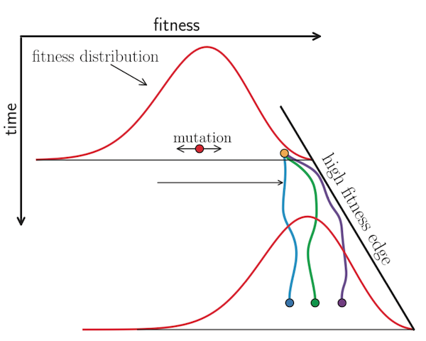

## Why is predicting flu evolution important?

Seasonal influenza (also known as "the flu") sickens or kills millions of people per year.
Flu vaccines are one of the most effective preventative measures against infection.
The most effective vaccines are those that contain viruses that are most representative of the viruses circulating during the corresponding flu season.
Rapid changes in the flu's appearance to our immune systems require us to pick a new vaccine almost every year.
The vaccine development process takes about one year to complete after the vaccine's composition has been determined.
This delay in selection of vaccine strains and availability of the vaccine at the start of the flu season require flu researchers to predict which currently circulating strains will be most representative of the future populations.
Better predictions can lead to more representative viruses in the vaccine and reduced illness and death from infection.

## How do we think flu evolves?

Flu viruses rapidly accumulate mutations due to faulty replication machinery (RNA-dependent RNA polymerase).
In the face of constant mutation, flu viruses must maintain their core functionality (its ability to infect cells, replicate, and spread to other cells and hosts) and also escape detection by host adaptive immunity.
Any random mutation that occurs is likely to impair flu's function, but some of these mutations will allow viruses to escape detection by existing host antibodies.
Viruses carrying these beneficial mutations should grow exponentially relative to viruses lacking those mutations.
If multiple viruses carry different beneficial mutations, they will compete with each other for hosts in a process known as clonal interference.
The ultimate success (and fixation) of these beneficial mutations depends, in part, on how many deleterious mutations already exist in the same genome and random processes that allow one mutation to win out before the others.

[Neher 2013](https://www.annualreviews.org/doi/abs/10.1146/annurev-ecolsys-110512-135920)

## What aspects of flu evolution might be predictable?

 - Positive selection at specific sites (on average these positively selected mutations should sweep through the global population)
 - Antigenic escape at specific epitopes (only a subset of positions in the flu genome might be relevant for antigenic escape, limiting the number of mutations we need to consider)
 - Canalization of antigenic phenotypes
 - Specific epitope mutations have been confirmed in the lab to produce distinct antigenic phenotypes
 - Population genetic models that successfully identified the closest strain to the future or that forecasted the future frequencies of phylogenetic clades [@luksza_predictive_2014;@neher_predicting_2014;@neher_prediction_2016]

In contrast:

 - Clonal interference, the competition of equally fit haplotypes for hosts, prevents beneficial mutations from fixing when another beneficial mutation happens to dominate first.
 - Relatively small transmission bottlenecks from infected to susceptible individuals can prevent beneficial mutations related to antigenic escape from surviving
 - Geographic transmission bottlenecks related to the seasonality of infections also limits the effective population size and increases the effects of genetic drift
 - Successful infection of a new host depends on the previous infection history of each host, such that mutations that escape one person's adaptive immunity will not necessarily escape the next potential host's immunity [@lee_mapping_2019]

## Does flu evolve like we think it does? (Barrat-Charlaix et al.)

- This work is based on frequency trajectories of *individual mutations*, which are not independent. Only mutations that were absent in the past are considered (*i.e.* "new" mutations, rising in frequency).
- For A/H3N2, frequency trajectories do not show much "inertia" *on average* (weak inertia for A/H1N1pdm). It is not possible to predict the short term dynamics of the frequency of a mutation based on the sole fact that it was rising in the recent past. Sweeps are not "typical" trajectories.
- For A/H3N2, the probability of fixation of a mutation rising in frequency is equal to the frequency at which it is observed (slightly larger for A/H1N1). This is similar to what would be found for neutral evolution. A rise in frequency does not give information w.r. future fixation.
- LBI and knowledge of epitope sites does not give information about fixation.
- Other features, such as multiple appearance of a mutation in the tree, geographical spread (etc...), give limited information about fixation.
- These are not trivial manifestations of genetic linkage and clonal interference, as simulations show.
- In terms of predicting future population with a single sequence, the consensus sequence performs slightly but consistently better than the LBI. It is also the theoretical best predictor for neutral evolution. In the long run, it also performs better than multiple local consensi (consensuses? hmm...) based on local LBI maximas.
- The top LBI strain is typically close to the consensus sequence, often identical.

## Can we forecast flu evolution? (Huddleston et al.)

- We can estimate the composition of a future population's haplotypes with a Malthusian growth model that minimizes the earth mover's distance (EMD) between estimated and observed populations.
- Models based on biologically-informed estimates of viral fitness can make more accurate forecasts of future populations compared to naive forecasts that assume a static population.
- The most accurate forecasts depend on phenotypic measures of antigenic drift (HI assays) and genotypic measures of functional constraint (non-epitope mutations).
- Models that use epitope mutations to measure antigenic drift fail to predict the future. Previous research where these mutations did predict the future most likely succeeded by inadvertently borrowing information from the future that was encoded in the definition of the epitope mutations themselves.
- Biologically-informed models can also estimate
    - future clade frequencies more accurately than the naive model but with substantial forecasting error for mid-frequency clades (i.e., 15-50% frequency)
    - the single closest strain to the future (the future population's centroid), but they do not perform much better than the naive model on average.
- Models based on recent positive variation of frequency do not perform well either.
- The dynamics of clade frequencies can be somewhat predicted, again compared to the naive scenario. *Note*: How are clades defined? Not clear to me.

## How have these results changed how we think about flu evolution?

 - From Barrat-Charlaix: "previous methods to predict influenza evolution work primarily because they pick strains that represent the future well, not because they predict future dynamics"
 - The genetic background of beneficial mutations is an important part of future success
   - The average behavior of rising mutations does not behave as expected
   - Fitness models based on phenotypes of antigenic drift and mutational load produce the most robust forecasts and outperform naive (neutral) models
   - Fitness models based on epitope mutations and DMS preferences from specific historical contexts fail to forecast the future
 - A neutral (naive or consensus) model selects the closest individual virus to the future population nearly as well or better than other biologically-informed models. Even if fitness models can more accurately estimate the composition of future populations than a neutral model, our dependence on a single virus for the vaccine strain prevents us from benefitting from this model-based improvement.

# Other bits

## Potential figures

 - Examples/cartoons of Malthusian growth, clonal interference, and traveling wave fitness landscapes
 - Sketch/cartoon summarizing different forecasting targets
 - Results from Barrat-Charlaix et al.
     - Frequency trajectories for mutations starting at ~30%
     - Probability of fixation by initial frequency and different metrics
     - Distance to the future by predictor and delta t
 - Forecasting results from Huddleston et al. (one or more of the following)
     - Model performance for best model (EMDs)
     - Clade frequency performance for best model
     - Comparison of best strains for vaccine selection

## Models behind previous forecasting efforts

 - Malthusian growth
 - clonal interference
 - traveling wave representation of fitness distributions
 - examples of previous forecasting efforts
     - Łuksza and Lässig (clade frequencies)
     - Steinbrück and McHardy (mutation frequencies)
     - Neher et al. (phylogenetic growth)
     - Reich et al. 2019, McGowan et al. 2019, etc. (ILI incidence and timing)
 - what we try to predict when we make forecasts
     - the single most representative strain of the future population (e.g., the future population's centroid)
     - the composition of haplotypes and their frequencies in the future population
     - whether an individual mutation or clade will increase or decrease in frequency (a boolean yes/no measure)
     - the frequency of individual mutations
     - the frequency of individual clades (>=15% initial frequency allowing for nested clades)
     - the probability that a mutation or clade will fix in the global population after some delta time

## Key differences

- Huddleston et. al. is based on fitness models, whereas Barrat-Charlaix et. al. considers "raw" data only.
- H predicts (one year ahead)
    - the population, with the EMD as a measure
    - clade frequencies
    - the single closest strain to the future
- H uses phenotypic measures of antigenic drift in addition to sequence-based measures
- BC tries to see if frequency trajectories of mutations show signs of selection that would make them predictable. This is addressed for short-term dynamics (do trajectories have inertia), and long-term destiny of mutations (fixation).
- H considers frequencies of haplotypes, whereas BC considers individual mutations. This is important, as clades are disjoint but mutations are not. A strain belongs to one clade only, but could carry different mutations.

## What we learned

- Fixation of a mutation is something hard to predict (beyond current frequency)
- But with models, one can to some extent predict what the pop. will look like a year ahead.
- Short term dynamics of the frequency of a mutation is also hard to predict. Frequency trajectories of mutations do not show much inertia.
- However, models make it possible to predict the evolution of the frequencies of clades, to some extent.

## References
