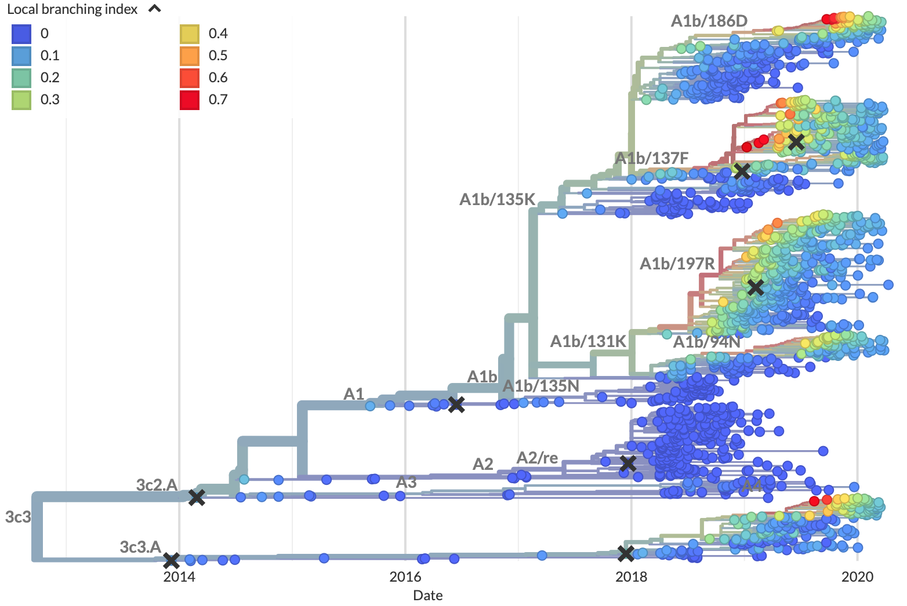

This post summarizes and synthesizes the results of two recent efforts to predict influenza evolution, @huddleston-2020 and @barrat-charlaix-2020.

## Why do we try to predict seasonal influenza evolution?

Seasonal influenza (or "flu") sickens or kills millions of people per year.
Flu vaccines are one of the most effective preventative measures against infection.
However, flu vaccines require almost a year to develop and can only contain a single representative virus per flu lineage (e.g., A/H3N2, A/H1N1pdm, etc.).
These limitations require researchers to predict which single current flu virus will be the most representative of the flu population one year in the future.
The better these predictions are, the more likely the vaccine will prevent illness and death from infection.

## How do we think flu evolves?

Flu rapidly accumulates mutations during replication, due to its error-prone RNA-dependent RNA polymerase.
For most flu genes, most new amino acid mutations will weaken the functionality of their corresponding proteins and reduce the virus's fitness.
For flu's primary surface proteins, hemagglutinin (HA) and neuraminidase (NA), some amino acid mutations modify binding sites of host antibodies from previous infections.
These mutations increase a virus's fitness by allowing the virus to escape existing antibodies in a process called antigenic drift ([@fig:beneficial-and-deleterious-mutations]).
HA and NA experience fitness trade-offs, as they acquire beneficial mutations associated with antigenic drift against a background of deleterious mutations.

![HA accumulates beneficial mutations in its head domain (sites with color) that enable escape from antibody binding and deleterious mutations in its stalk domain (sites in gray) that reduce its ability to infect new host cells. The one-dimensional genome view on the left shows how sites from HA's head domain map to the three-dimensional structure of an HA trimer. The site highlighted in yellow reveals where different amino acid mutations allowed a flu virus to escape binding from existing antibodies in a human's polyclonal sera [@lee-mapping-2019]. [Explore this figure interactively with dms-view.](https://dms-view.github.io/?markdown-url=https%3A%2F%2Fdms-view.github.io%2Fdata%2FIAV%2Flee2019mapping.md&data-url=https%3A%2F%2Fdms-view.github.io%2Fdata%2FIAV%2Fflu_dms-view.csv&condition=2009-age-53&site_metric=site-Positive+Differential+Selection&mutation_metric=mut-Positive+Differential+Selection&selected_sites=52%2C53%2C54%2C55%2C56%2C57%2C58%2C59%2C60%2C61%2C62%2C63%2C64%2C65%2C66%2C67%2C68%2C69%2C70%2C71%2C72%2C73%2C74%2C75%2C76%2C77%2C78%2C79%2C80%2C81%2C82%2C83%2C84%2C85%2C86%2C87%2C88%2C89%2C90%2C91%2C92%2C93%2C94%2C95%2C96%2C97%2C98%2C99%2C100%2C101%2C102%2C103%2C104%2C105%2C106%2C107%2C108%2C109%2C110%2C111%2C112%2C113%2C114%2C115%2C116%2C117%2C118%2C119%2C120%2C121%2C122%2C123%2C124%2C125%2C126%2C127%2C128%2C129%2C130%2C131%2C132%2C133%2C134%2C135%2C136%2C137%2C138%2C139%2C140%2C141%2C142%2C143%2C144%2C145%2C146%2C147%2C148%2C149%2C150%2C151%2C152%2C153%2C154%2C155%2C156%2C157%2C158%2C159%2C160%2C161%2C162%2C163%2C164%2C165%2C166%2C167%2C168%2C169%2C170%2C171%2C172%2C173%2C174%2C175%2C176%2C177%2C178%2C179%2C180%2C181%2C182%2C183%2C184%2C185%2C186%2C187%2C188%2C189%2C190%2C191%2C192%2C193%2C194%2C195%2C196%2C197%2C198%2C199%2C200%2C201%2C202%2C203%2C204%2C205%2C206%2C207%2C208%2C209%2C210%2C211%2C212%2C213%2C214%2C215%2C216%2C217%2C218%2C219%2C220%2C221%2C222%2C223%2C224%2C225%2C226%2C227%2C228%2C229%2C230%2C231%2C232%2C233%2C234%2C235%2C236%2C237%2C238%2C239%2C240%2C241%2C242%2C243%2C244%2C245%2C246%2C247%2C248%2C249%2C250%2C251%2C252%2C253%2C254%2C255%2C256%2C257%2C258%2C259%2C260%2C261%2C262%2C263%2C264%2C265%2C266%2C267%2C268%2C269%2C270%2C271%2C272%2C273%2C274%2C275%2C276&protein-data-color=&protein-other-color=&pdb-url=https%3A%2F%2Fdms-view.github.io%2Fdata%2FIAV%2F4O5N_trimer.pdb)](images/beneficial-and-deleterious-mutations-in-ha.png){#fig:beneficial-and-deleterious-mutations}

Viruses carrying beneficial mutations should grow exponentially relative to viruses lacking those mutations ([@fig:exponential-growth-with-clonal-interference]A).
If beneficial mutations have large effects on fitness, viruses with different beneficial mutations will compete with each other for hosts in a process known as clonal interference ([@fig:exponential-growth-with-clonal-interference]B).
In this case, the fitness of the genetic background where the beneficial mutations occur is less important for the success of the virus than the fitness effect of the beneficial mutations themselves ([@fig:fitness-landscapes]).
If beneficial mutations have similar, smaller effects on fitness, a virus's overall fitness depends on the effect of the beneficial mutations and the relative fitness of its genetic background.
The ultimate success and fixation of these beneficial mutations depends, in part, on the number of deleterious mutations that already exist in the same genome ([@fig:fixation-probability]).

{#fig:exponential-growth-with-clonal-interference}

{#fig:fitness-landscapes}

{#fig:fixation-probability}

## What is predictable about flu evolution?

The expectations from population genetic theory described above and previous experimental work suggest that aspect of flu's evolution might be predictable.
Mutations in HA and NA that alter host antibody binding sites and enable viruses to reinfect hosts should be under strong positive selection.
We expect these strongly beneficial mutations to sweep through the global flu population at a rate that depends on the importance of their genetic background.
To reduce the complexity of our analyses, we do not necessarily need to consider every possible amino acid mutation.
For example, fewer than a quarter of HA's 566 amino acid sites are under positive selection [@bush-1999], have undergone rapid sweeps [@shih-2007], or contributed to antigenic drift [@wolf-2006].
Importantly, not all of these sites contribute equally to antigenic drift [@koel-2013].
Additionally, the strong pressure for viruses to escape human immunity and the limited choices viruses have to escape likely constrain the space of antigenic phenotypes viruses can reach at any given time [@smith-2004; @bedford-2012].

Recently, researchers have built on this evidence to create formal predictive models of flu evolution.
@neher-predicting-2014 used expectations from traveling wave models to define the "local branching index" (LBI) estimate of viral fitness.
LBI assumes that most extant viruses descend from a highly fit ancestor in the recent past and uses patterns of rapid branching in phylogenies to identify putative fit ancestors ([@fig:lbi]).
@neher-predicting-2014 showed that LBI could successfully identify ancestral nodes that were highly representative of the flu population one year in the future.
Similarly, @neher-prediction-2016 mapped experimental measurements of antigenic drift to phylogenies to identify the most representative virus in the future flu population.

{#fig:lbi-theory width=45%}

{#fig:lbi-tree width=50%}

Local branching index (LBI) estimates the fitness of viruses in a phylogeny

@luksza-predictive-2014 developed a mechanistic model to forecast flu evolution based on population genetic theory and previous experimental work.
This model assumed that flu viruses grow exponentially as a function of their fitness, compete with each other for hosts through clonal interference, and balance positive effects of mutations at sites previously associated with antigenic drift and deleterious effects of all other mutations.
Instead of predicting the most representative virus of the future population, @luksza-predictive-2014 explicitly predicted the future frequencies of entire clades.

Despite the success of these predictive models, other aspects of flu evolution complicate predictions.
When multiple beneficial mutations with large effects emerge in a population, the clonal interference between viruses reduces the probability of fixation for all mutations involved.
Flu populations also experience multiple bottlenecks in space and time including transmission between hosts, global circulation, and seasonality.
These bottlenecks reduce flu's effective population size and reduce the predictability of beneficial mutations sweeping globally.
Finally, antigenic escape assays with polyclonal human sera suggest that successful viruses must accumulate multiple beneficial mutations of large effect to successfully evade the diversity of global host immunity [@lee-mapping-2019].

## Does flu evolve like we think it does?

In [Barrat-Charlaix et al.](https://www.biorxiv.org/content/10.1101/2020.07.31.231100v1), we investigated the predictability of flu mutation frequencies.
We explicitly avoided modeling flu evolution and focused on an empirical account of long-term outcomes for mutation frequency trajectories.
We selected all available HA and NA sequences for flu lineages A/H3N2 and A/H1N1pdm, performed multiple sequence alignments per lineage and gene, binned sequences by month, and calculated the frequencies of mutations per site and month.
From these data, we constructed frequency trajectories of individual mutations that were rising in frequency from zero.
We expected these rising mutations to represent beneficial, large-effect mutations that would sweep through the global population as predicted by the traveling wave models described above.
By considering individual mutations, we effectively averaged the outcomes of these mutations across all genetic backgrounds.
We evaluated the outcomes of trajectories for mutations that had risen from 0% to approximately 30% global frequency and classified trajectories for mutations that fixed, died out, or persisted as polymorphisms.

<!-- Import Vega & Vega-Lite (does not have to be from CDN) -->

<!-- Import vega-embed -->

As shown above, the average trajectory of individual rising A/H3N2 mutations failed to rise toward fixation.
Instead, the future frequency of these mutations was no higher on average than their initial frequency.
We repeated this analysis for mutations with initial frequencies of 50% and 75% and for mutations in A/H1N1pdm and found nearly the same results.
From these results, we concluded that it is not possible to predict the short-term dynamics of individual mutations based solely on their recent success.

Next, we calculated the fixation probability of each mutation trajectory based on its initial frequency.
Surprisingly, we found that the fixation probabilities of A/H3N2 mutations were equal to their initial frequencies.
This pattern corresponds to what we expect for mutations evolving neutrally.
Generally, the pattern remained the same even when we binned mutations by high LBI, presence at epitope sites, multiple appearances of a mutation in a tree, geographic spread, or other potential metrics associated with high fitness.
We concluded that the recent success of rising mutations provides no information about their eventual fixation.

We tested whether we could explain these results by genetic linkage or clonal interference by simulating flu-like populations under these evolutionary constraints.
Mutation trajectories from simulated populations were more predictable than those from natural populations.
The closest our simulations came to matching the uncertainty of natural populations was when we dramatically increased the rate at which the fitness landscape of simulated populations changed.
These results suggested that we cannot explain the unpredictable nature of flu mutation trajectories by linkage or clonal interference alone.

Since flu mutations appeared to evolve neutrally in the long-term and LBI did not provide information about eventual fixation of mutations, we wondered whether we could identify the most representative sequence of future populations with a different metric.
The consensus sequence is provably the best predictor for a neutrally evolving population.
We found that the consensus sequence is often closer to the future population than the virus sequence with the highest LBI.
Indeed, we found that the top LBI virus was frequently similar to the consensus sequence and often identical.

Taken together, our results from this empirical analysis reveal that beneficial mutations of large effect do not predictably sweep through flu populations and fix.
Instead, the average outcome for any individual mutation evokes neutral evolution, despite the strong positive selection expected to act on these mutations.
Although simulations rule out clonal interference between large effect mutations as an explanation for these results, we cannot discount the role of multiple mutations of similar, smaller effects in the overall fitness of flu viruses.

## Can we forecast flu evolution?

In [Huddleston et al. 2020](https://doi.org/10.7554/eLife.60067), we built a modeling framework based on the approach described in @luksza-predictive-2014 to forecast flu A/H3N2 populations one year in advance.
We used this framework to predict the sequence composition of the future population, the frequency dynamics of clades, and the virus in the current population that most represented the future population.
As in Barrat-Charlaix et al. and @luksza-predictive-2014, we assumed that viruses grow exponentially as a function of their fitness and that viruses with similarly high fitness compete with each other for hosts through the process of clonal interference.
In contrast to Barrat-Charlaix et al., we considered the fitness of complete amino acid haplotypes instead of individual mutations.

We estimated fitness with metrics based on HA sequences and experimental measurements of antigenic drift and functional constraint.
The sequence-based metrics included the epitope cross-immunity and mutational load estimates defined by @luksza-predictive-2014, @neher-predicting-2014's LBI, and "delta frequency", a measure of recent change in clade frequency analogous to Barrat-Charlaix's rising mutations.
The experimental metrics included a cross-immunity measure based on hemagglutination inhibition (HI) assays and an estimate of functional constraint based on mutational preferences from deep mutational scanning experiments [@lee-2018].

We fit coefficients for each of these metrics independently and a subset of complementary metrics in combination, using 25 years of historical training data.
The final coefficients for each model minimized the earth mover's distance between the estimated and observed amino acid haplotype composition of the future ([@fig:fitness-model]).
We tested the accuracy of each model by applying the coefficients from the training data to forecasts of new out-of-sample data from the last 5 years of A/H3N2 evolution.
As a control, we calculated the distance to the future population for a naive model that assumes the future population is the same as the current population.

{#fig:fitness-model}

We found that the most robust forecasts depended on a combined model of experimentally-informed antigenic drift and sequence-based mutational load
Importantly, this model explicitly accounts for the benefits of antigenic drift and the costs of deleterious mutations.
This model also slightly outperformed the naive model in its estimated of flu clade frequencies.
However, we found that the naive model often selected individual strains that were as close to the future population as the best biologically-informed model.
The naive model's estimated closest strain to the future is effectively the weighted average of the current population and conceptually similar to the consensus sequence of the population.
From these results, we concluded that the predictive gains of fitness models depend on the prediction target.

Surprisingly, the sequence-based metrics of epitope cross-immunity and delta frequency and the mutational preferences from DMS experiments had little predictive power.
These metrics failed to make accurate forecasts because of their dependence on a specific historical context.
For example, the original epitope cross-immunity metric [@luksza-predictive-2014] depends on a predefined list of epitope sites that were originally identified in a retrospective study of flu sequences up through 2005 [@shih-2007].
This metric correspondingly failed to predict the future after 2005, suggesting that its previous success depended on inadvertently borrowing information from the future.
Similarly, the mutational preferences from DMS experiments originate from laboratory experiments with the virus A/Perth/16/2009.
The metric based on these preferences failed to predict the future after 2009, reflecting the strong dependence of these preferences on their original genetic background.
Both delta frequency and LBI suffered from overfitting to the training data, in a more general form of historical dependence.

{#fig:simulated-mutation-trajectories width=60%}

{#fig:distance-to-consensus-model}

- Distance from consensus sequence is nearly as good at predicting distance to future natural populations as antigenic phenotypes and mutational load (include figure here)

## How have these results changed how we think about flu evolution?

In general, we found that the evolution of flu populations remains difficult to predict.
The frequency dynamics and fixation probabilities of individual beneficial mutation resemble neutrally evolving alleles.
Correspondingly, the most representative sequence of future flu populations is the consensus sequence of the current population and not necessarily the sequence with the highest local branching index.
Simulations of flu-like populations show that we cannot explain these patterns by simple epistasis and clonal interference alone.

Successful flu predictions depend on the choice of prediction targets and fitness metrics.
We cannot estimate a mutation's fixation probability any better than its current frequency.
We can weakly predict the frequency dynamics of flu clades when we combine experimental and genetic data in models that account for antigenic drift and mutational load.
Better still, we can use these same models to predict the sequence composition of future flu populations.
However, these complex fitness models barely outperform a naive weighted average of the current population, when predicting the current virus that is most representative of the future population.

There is a lot for us to learn from these results.
Future prediction efforts should focus on estimating the composition of future populations instead of the more complex target of frequency dynamics.
Fitness models should account for the genetic background of beneficial mutations and favor fitness metrics that are the least susceptible to model overfitting and historical contingency.
Most importantly, there is a lot of room to improve.
The benefits of considering the genetic background of individual mutations in HA suggest that considering the context of all genes may yield gains, too.
Antigenic drift measurements from human populations instead of ferrets and modeling of global migration patterns could also improve predictions.

 - A neutral (naive or consensus) model selects the closest individual virus to the future population nearly as well or better than other biologically-informed models. Even if fitness models can more accurately estimate the composition of future populations than a neutral model, our dependence on a single virus for the vaccine strain prevents us from benefitting from this model-based improvement.

Metric | Single strain | Population composition | Frequency dynamics | Fixation
------ | ------------- | ---------------------- | ------------------ | --------
initial frequency | none | N/A | none | none
antigenic drift (epitope mutations) | N/A | none | N/A | N/A
antigenic drift (serological data) | good | good | weak (with mutational load) | N/A
mutational load (non-epitope mutations) | N/A | weak | N/A | N/A
local branching index | good | weak | none | none
consensus sequence / naive model | good | weak | none | N/A
DMS mutational preferences | N/A | none | N/A | N/A

## References
